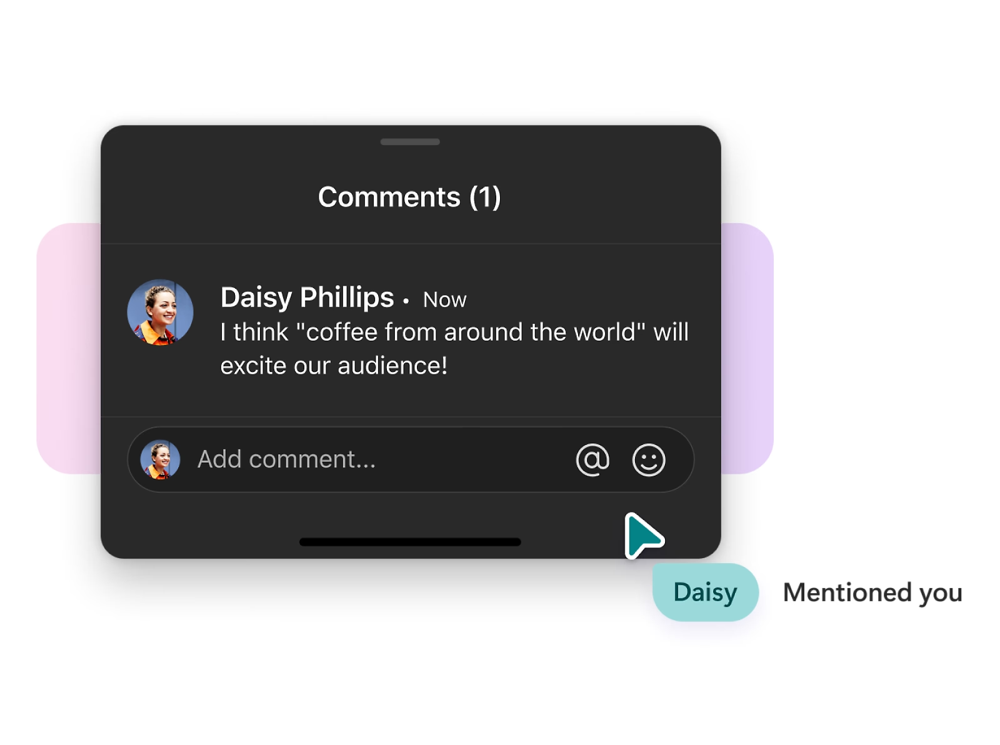
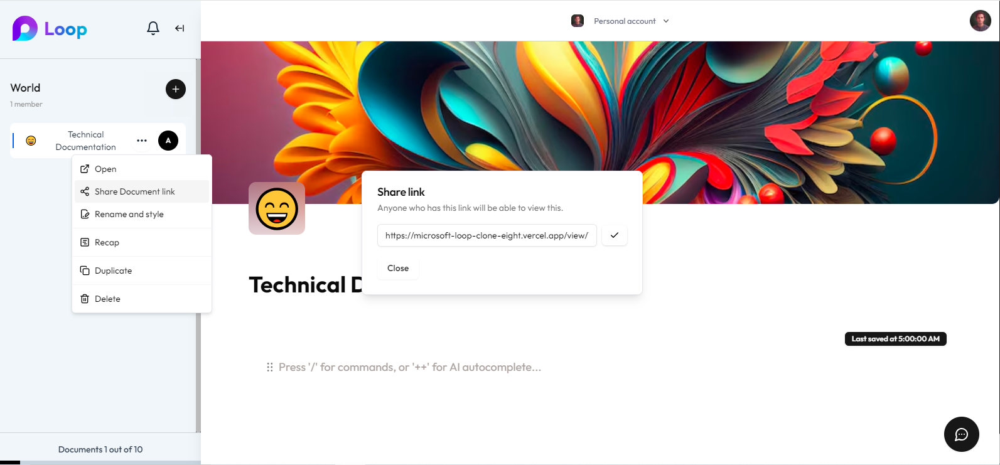

# Microsoft Loop Clone

This is a clone of the Microsoft Loop application, built using Next.js for both frontend and backend, with Tailwind CSS for styling, and Firebase for the backend database. The project replicates key features of Microsoft Loop, including collaborative workspaces, real-time document editing, and a notification system for seamless teamwork.

## Live Demo

<video width="100%" controls autoplay muted playinline>
  <source src="public/videos/loop.mp4" type="video/mp4">
  Your browser does not support the video tag.
</video>

Check out the live demo of the Microsoft Loop Clone [here](loop-microsoft.vercel.app).

## Features


- **Authentication**: User authentication is managed by Clerk Auth, enabling secure login and registration.


- **Dashboard**: Displays all workspaces associated with the authenticated user. Each workspace can have up to 10 documents, and each workspace can be customized with a name, cover image, and emoji.


- **Real-time Collaboration**: The rich text editor supports real-time, collaborative editing using the Novel Lightweight editor, allowing multiple users to work on the same document simultaneously.


- **Comments and Mentions**: Users can comment on documents and tag other members of the workspace. Tagged users receive notifications in the notification panel.



- **Notification Panel**: A panel that notifies users when they are tagged or when important changes occur within the workspace.


- **Public Sharing**: Documents can be shared publicly, allowing others to view the content (with authentication) without being able to comment.



## Tech Stack

- **Next.js**: Framework for building server-rendered React applications.
- **Tailwind CSS**: Utility-first CSS framework for styling.
- **shadcn/ui**: A UI component library for building accessible and customizable UIs.
- **Clerk Auth**: Authentication and user management.
- **Vercel AI SDK**: Tools and integrations for adding AI features.
- **Firebase**: Backend as a Service (BaaS) for database and real-time updates.
- **emoji-picker-react**: A library for adding emoji picking functionality.
- **lucide-react**: A collection of beautifully simple and crisp icons.
- **novel-lightweight**: A lightweight rich text editor for real-time collaboration.

## Project Structure

```bash
├── app
│   ├── _components
│   ├── _utils
│   ├── (auth)
│   ├── (routes)
│   ├── api
│   ├── global-error.js
│   ├── global.css
│   ├── icon.png
│   ├── layout.js
│   ├── loading.js
│   ├── not-found.js
│   ├── page.js
│   └── view
│       ├── [documentId]
│       └── workspace
│           └── [workspaceId]
├── public
│   ├── icons
│   ├── images
│   ├── videos
│   └── .env.local
├── .gitignore
├── jsconfig.json
├── next.config.js
├── postcss.config.js
├── tailwind.config.js
├── README.md
└── package.json
```

## Installation

1. Clone the repository:
   ```bash
   git clone https://github.com/anas-aqeel/microsoft-loop-clone
   ```
2. Install dependencies:
   ```bash
   cd microsoft-loop-clone
   npm install
   ```
3. Set up environment variables:
   - Copy the `.env` file to the root directory.
   - Add your Firebase configuration and Clerk API keys.

4. Run the development server:
   ```bash
   npm run dev
   ```
   Open [http://localhost:3000](http://localhost:3000) with your browser to see the result.

## Usage

- **Landing Page**: Start exploring the app from the landing page.
- **Authentication**: Sign up or log in using Clerk Auth.
- **Dashboard**: Create or select a workspace to begin collaborative editing.
- **Workspace**: Add documents, edit in real-time, comment, and share with others.


## License

This project is licensed under the MIT License.

## Acknowledgements

- Inspired by Microsoft Loop.

